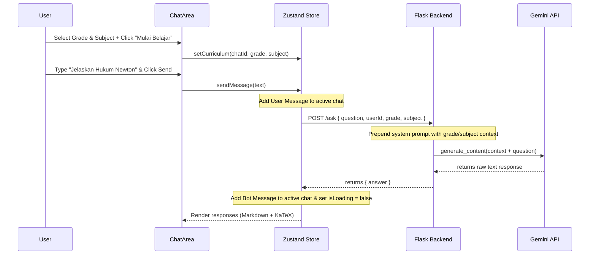

# Design Document: React Migration and Curriculum Chat UI

## 1. Architectural Impact

This update replaces the Vanilla JS frontend inside `/frontend` with a React 19 + Vite + TypeScript single-page application (SPA). The backend Python Flask server remains unchanged in terms of framework, but its routing logic is updated to support contextual prompt engineering based on the student's selected grade and subject.

---

## 2. Component Structure

The frontend application follows the Atomic Design principles and component folder conventions:

```text
src/
├── components/
│   ├── atoms/
│   │   ├── Button/
│   │   │   ├── index.tsx
│   │   │   ├── Button.tsx
│   │   │   └── Button.module.css
│   │   ├── Input/
│   │   │   ├── index.tsx
│   │   │   ├── Input.tsx
│   │   │   └── Input.module.css
│   │   ├── Avatar/
│   │   │   ├── index.tsx
│   │   │   ├── Avatar.tsx
│   │   │   └── Avatar.module.css
│   │   └── Spinner/
│   │       ├── index.tsx
│   │       ├── Spinner.tsx
│   │       └── Spinner.module.css
│   ├── molecules/
│   │   ├── SearchBar/
│   │   │   ├── index.tsx
│   │   │   ├── SearchBar.tsx
│   │   │   └── SearchBar.module.css
│   │   ├── ChatBubble/
│   │   │   ├── index.tsx
│   │   │   ├── ChatBubble.tsx
│   │   │   └── ChatBubble.module.css
│   │   └── OptionCard/
│   │       ├── index.tsx
│   │       ├── OptionCard.tsx
│   │       └── OptionCard.module.css
│   ├── organisms/
│   │   ├── Sidebar/
│   │   │   ├── index.tsx
│   │   │   ├── Sidebar.tsx
│   │   │   └── Sidebar.module.css
│   │   ├── ChatArea/
│   │   │   ├── index.tsx
│   │   │   ├── ChatArea.tsx
│   │   │   └── ChatArea.module.css
│   │   ├── WelcomeForm/
│   │   │   ├── index.tsx
│   │   │   ├── WelcomeForm.tsx
│   │   │   └── WelcomeForm.module.css
│   │   └── SettingsModal/
│   │       ├── index.tsx
│   │       ├── SettingsModal.tsx
│   │       └── SettingsModal.module.css
│   └── templates/
│       └── AppShell/
│           ├── index.tsx
│           ├── AppShell.tsx
│           └── AppShell.module.css
├── pages/
│   └── MainChatPage/
│       ├── index.tsx
│       ├── MainChatPage.tsx
│       ├── MainChatPage.constants.ts
│       └── MainChatPage.module.css
├── store/
│   └── chatStore.ts           # Zustand store for chat history and active session state
├── types/
│   └── chat.ts                # TypeScript interfaces
├── utils/
│   └── api.ts                 # Fetch client for Flask backend
├── App.tsx                    # Main router/controller
└── main.tsx                   # Vite mounting point
```

---

## 3. Zustand Store Design (`chatStore.ts`)

The global application state is managed by Zustand to avoid prop-drilling.

### State Interface
```typescript
interface IMessage {
  id: string;
  sender: 'user' | 'bot';
  text: string;
  timestamp: string;
}

interface IChatSession {
  id: string;
  title: string;
  messages: IMessage[];
  grade: string | null;
  subject: string | null;
  createdAt: string;
}

interface IChatState {
  chats: IChatSession[];
  activeChatId: string | null;

  searchQuery: string;
  isSidebarOpen: boolean;
  isSettingsOpen: boolean;
  isLoading: boolean;
  userId: string;
  
  // Actions
  initUserId: () => void;
  createNewChat: () => void;
  selectChat: (id: string) => void;
  deleteChat: (id: string) => void;
  setCurriculum: (id: string, grade: string | null, subject: string | null) => void;
  sendMessage: (text: string) => Promise<void>;
  setSearchQuery: (query: string) => void;
  toggleSidebar: () => void;
  toggleSettings: () => void;
  clearAllData: () => void;
}
```

---

## 4. UI Layout & Styling Decisions

- **Main Theme:** Vibrant, clean dark mode layout (with support for glassmorphism panels) using a Tailwind CSS palette:
  - Background: Deep slate/dark gray (`bg-slate-950`).
  - Panels: Translucent slate (`bg-slate-900/50 backdrop-blur-md`).
  - Accents: Violet/Indigo (`from-violet-600 to-indigo-600`) for primary buttons and bot message bubbles.
- **Sidebar:** Fixed 260px width on desktop. On mobile, it slides in using translation transforms and overlays the main screen.
- **Curriculum Selector Card:** Displayed in the center of the Chat Area if the current chat session has `grade === null && subject === null`. Features gradient border effects.
- **Typography:** Using *Inter* or *Outfit* google fonts. Math equations rendered inline and block using KaTeX.

---

## 5. Data Flow Diagram



---

## 6. Technical Constraints & Security

1. **Strict Typing:** No implicit `any` in TypeScript files.
2. **Local Storage:** The Zustand store will use `zustand/middleware` for automatic persistence of the `chats` list.
3. **API Routing Security:** The frontend will fetch from the URL specified in environment variables (default `http://127.0.0.1:5000`).
