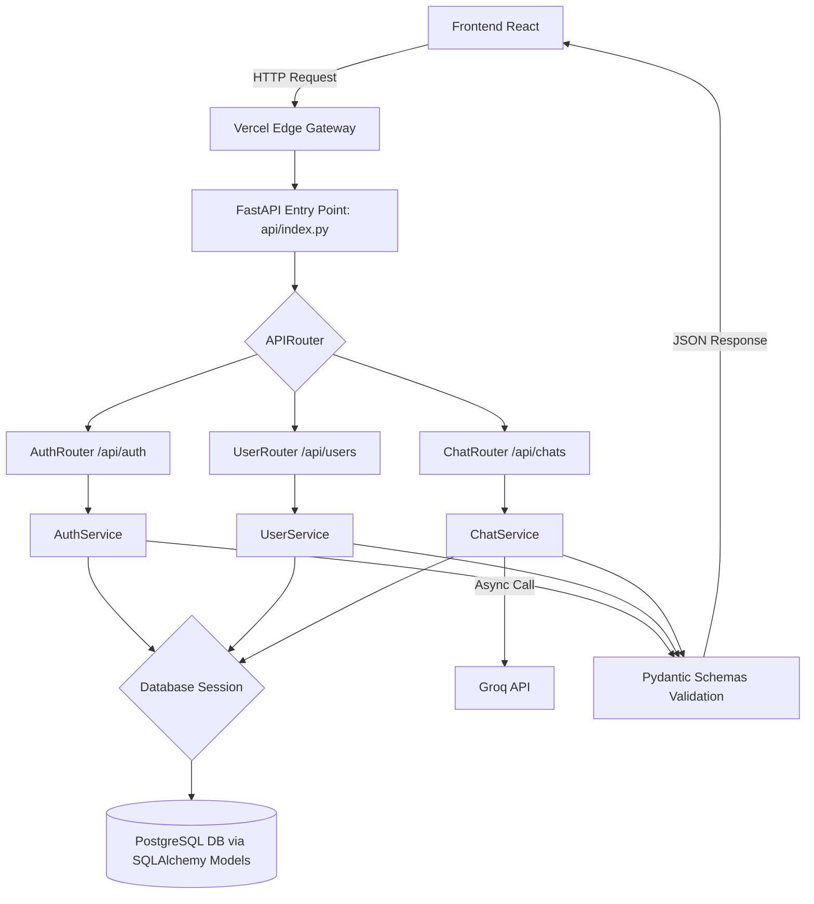

# Design Document: backend-migration

## Overview

Desain ini mendefinisikan perubahan arsitektur aplikasi backend PintarAI dari Flask (monolitik) menjadi FastAPI (Layered Serverless Architecture). Tujuan utama dari refactoring ini adalah menerapkan pemisahan tugas (Separation of Concerns) yang jelas menggunakan desain berlapis (routers, services, schemas, models) sehingga kode mudah di-maintain, diuji, dan sangat ideal untuk di-deploy sebagai Vercel Serverless Functions. Framework FastAPI dipilih untuk performa *asynchronous* yang tinggi dan auto-dokumentasi API (Swagger).

---

## Architecture

### Application Flow



### Layer Structure

```text
backend/
├── api/
│   ├── index.py                 # FastAPI app initialization & route aggregation
│   └── routers/                 # Controller layer
│       ├── auth_router.py
│       ├── user_router.py
│       └── chat_router.py
├── core/                        # Cross-cutting concerns
│   ├── config.py                # Environment variables loading
│   ├── security.py              # JWT Token logic & Password Hashing
│   ├── database.py              # SQLAlchemy engine & session maker
│   └── exceptions.py            # Custom global error handlers
├── models/                      # SQLAlchemy Class representations (DB)
│   ├── user_model.py
│   └── chat_model.py
├── schemas/                     # Pydantic validation rules (API DTOs)
│   ├── user_schema.py
│   ├── chat_schema.py
│   └── token_schema.py
├── services/                    # Business Logic layer (OOP Classes)
│   ├── auth_service.py
│   ├── user_service.py
│   └── chat_service.py
├── requirements.txt             # Python dependencies
└── vercel.json                  # Vercel Serverless configurations
```

---

## Components and Interfaces

### Data Models (SQLAlchemy)

#### User Model
```python
class User(Base):
    __tablename__ = "user"
    id = Column(Integer, primary_key=True, index=True)
    email = Column(String(120), unique=True, index=True, nullable=False)
    name = Column(String(100), nullable=True)
    password_hash = Column(String(255), nullable=False)
    # Relationship to ChatSession
    chats = relationship("ChatSession", back_populates="user", cascade="all, delete-orphan")
```

#### ChatSession Model
```python
class ChatSession(Base):
    __tablename__ = "chat_session"
    id = Column(String(36), primary_key=True, default=lambda: str(uuid.uuid4()))
    user_id = Column(Integer, ForeignKey('user.id'), nullable=False)
    title = Column(String(200), default="Obrolan Baru")
    subject = Column(String(100), nullable=True)
    grade = Column(String(50), nullable=True)
    created_at = Column(DateTime, default=datetime.utcnow)
    updated_at = Column(DateTime, default=datetime.utcnow, onupdate=datetime.utcnow)
    
    user = relationship("User", back_populates="chats")
    messages = relationship("Message", back_populates="chat", cascade="all, delete-orphan", order_by="Message.timestamp")
```

#### Message Model
```python
class Message(Base):
    __tablename__ = "message"
    id = Column(Integer, primary_key=True, index=True)
    chat_id = Column(String(36), ForeignKey('chat_session.id'), nullable=False)
    sender = Column(String(10), nullable=False) # 'user' or 'ai'
    text = Column(Text, nullable=False)
    timestamp = Column(DateTime, default=datetime.utcnow)
    
    chat = relationship("ChatSession", back_populates="messages")
```

### Data Transfer Objects (Pydantic Schemas)

```python
# schemas/user_schema.py
class UserCreate(BaseModel):
    email: EmailStr
    name: str
    password: str

class UserResponse(BaseModel):
    id: int
    email: str
    name: Optional[str]
    
    class Config:
        from_attributes = True

# schemas/chat_schema.py
class ChatCreate(BaseModel):
    subject: str
    grade: str

class MessageCreate(BaseModel):
    text: str

class MessageResponse(BaseModel):
    id: int
    sender: str
    text: str
    timestamp: datetime
    
    class Config:
        from_attributes = True
```

### API Endpoints Mapping

| Method | Route | Router | Service | Pydantic Request | Pydantic Response |
|--------|-------|--------|---------|------------------|-------------------|
| POST | `/api/auth/register` | `auth_router` | `AuthService.register` | `UserCreate` | `UserResponse` |
| POST | `/api/auth/login` | `auth_router` | `AuthService.login` | OAuth2Form | `TokenSchema` |
| GET | `/api/users/profile` | `user_router` | `UserService.get_profile` | None | `UserResponse` |
| POST | `/api/chats/` | `chat_router` | `ChatService.create_chat` | `ChatCreate` | `ChatResponse` |
| POST | `/api/chats/{id}/messages`| `chat_router` | `ChatService.send_message`| `MessageCreate` | `MessageResponse` (AI text)|

---

## Correctness Properties

*A property adalah karakteristik atau perilaku yang harus berlaku benar di semua eksekusi valid dari sebuah sistem.*

### Property 1: Password tidak pernah dikembalikan ke client
*For any* request HTTP yang mengambil data profil atau melakukan registrasi, objek JSON yang dikembalikan tidak boleh mengandung atribut `password` maupun `password_hash`. Hal ini dijamin melalui pemfilteran oleh `UserResponse` Pydantic Schema.

**Validates: Requirement 2.3**

### Property 2: Routing akses profil hanya untuk pemiliknya
*For any* token JWT yang dikirim di header, `UserService` hanya akan memperbarui atau mengambil data pengguna berdasarkan `user_id` yang di-*decode* dari token tersebut. Mustahil bagi user A untuk mengedit profil user B tanpa token user B.

**Validates: Requirement 2.1, 2.4**

### Property 3: Chat session menghapus pesan secara *cascade*
*For any* request DELETE ke `/api/chats/{session_id}`, ketika sesi berhasil dihapus, maka seluruh baris tabel `Message` yang bereferensi ke `chat_id` tersebut harus terhapus tanpa meninggalkan yatim (orphan rows). Hal ini dikonfigurasi pada SQLAlchemy `cascade="all, delete-orphan"`.

**Validates: Requirement 3.5**

### Property 4: AI Context mengambil N riwayat sebelumnya
*For any* pemanggilan fungsi ke `Groq_API` melalui `ChatService`, argumen list of messages (*array of chat dicts*) harus mengandung pesan-pesan sebelumnya dalam urutan waktu yang tepat agar AI memiliki konteks percakapan.

**Validates: Requirement 4.3, 4.4**

---

## Error Handling

Implementasi exception di FastAPI menggunakan *Exception Handlers* global dan `HTTPException`.

| Service | Kondisi Error | Tipe Error HTTP | Pesan Body |
|---------|---------------|-----------------|------------|
| `AuthService` | Email sudah dipakai | 400 Bad Request | `{"detail": "Email already registered"}` |
| `AuthService` | Password salah | 401 Unauthorized | `{"detail": "Invalid credentials"}` |
| `Security` | Token kadaluarsa / rusak | 401 Unauthorized | `{"detail": "Could not validate credentials"}` |
| `ChatService` | Groq API Timeout/Error | 502 Bad Gateway | `{"detail": "Error communicating with AI Service"}` |
| `ChatService` | ID chat tidak valid/bukan milik user | 404 Not Found | `{"detail": "Chat session not found"}` |

---

## Testing Strategy

- Karena refactoring ini mengubah kerangka kerja (*framework*), kita akan menggunakan **Pytest** dipadukan dengan **FastAPI TestClient**.
- Setiap `Router` diuji menggunakan `TestClient` untuk validasi endpoint (Status code dan Schema response).
- `Service` diuji sebagai Unit Test secara independen dengan Mock/MagicMock untuk menggantikan SQLAlchemy Database Session dan Groq API (menghindari call API berbayar saat test).
- *Coverage Target*: >= 80% lines pada folder `services/` dan `api/routers/`.
