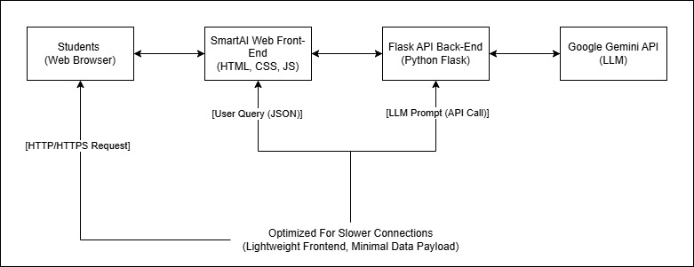

# PintarAI - AI Virtual Tutor MVP

## Project Overview

PintarAI is an AI-powered virtual tutor designed as a solution to address the educational gap faced by high school students in rural areas, particularly within the ASEAN region. These students often lack access to physical teachers due to geographical and cost barriers.

This project was developed as a technical code challenge for the INFREV AI Engineer Intern application. It demonstrates a functional Minimum Viable Product (MVP) that allows students to interact with an AI tutor to get explanations and answers to their academic questions.

## Problem Statement Addressed

* **Lack of Access:** Rural high school students in ASEAN struggle to access physical teachers due to high hiring costs and urban concentration of educators.
* **Widening Education Gap:** This disparity leads to a growing educational divide between urban and rural areas.
* **Solution Need:** An urgent need for new AI-powered virtual tutor software tools to assist these students.

## Key Features (MVP)

The current MVP of PintarAI includes the following functionalities:

1.  **Interactive Chat Interface:** A simple, intuitive chat window where students can type their questions.
2.  **AI-Powered Explanations:** Integration with a Large Language Model (LLM) to provide clear, concise, and context-aware answers to academic inquiries.
3.  **Unique User Identification:** A simple mechanism to generate and store a unique ID for each user (in browser's localStorage), allowing the backend to differentiate between users.
4.  **Optimized for Slower Connections:** The frontend is designed to be lightweight, minimizing data payload, and includes a "thinking" message to manage user expectations during AI processing, crucial for areas with limited internet infrastructure.

## Architecture

The system follows a simple client-server architecture:


* **Student (Web Browser):** Users interact with the application through their web browser.
* **PintarAI Web Frontend:** Built with **HTML, CSS, and Native JavaScript** for a lightweight and accessible user interface.
* **Flask API Backend:** Developed in **Python** using the **Flask** framework, serving as the bridge between the frontend and the AI model. It handles user requests, interacts with the LLM, and manages API key security.
* **Google Gemini API (LLM):** Utilizes the **Google Gemini API** (e.g., `gemini-1.5-flash`) as the core AI engine to process natural language questions and generate answers.

## Technologies Used

* **Frontend:** HTML, CSS, Native JavaScript
* **Backend:** Python 3.x, Flask
* **AI Model:** Google Gemini API (via `google-generativeai` Python library)
* **Environment Management:** `python-dotenv` for managing API keys
* **Dependency Management:** `pip` and `requirements.txt`

## Estimated Monthly Costs for MVP

PintarAI's MVP is designed with cost-efficiency in mind, leveraging free-tier services.

* **Backend Hosting (Python Flask API):** Estimated at **$0 - $7 per month**. This can be deployed on platforms like Google Cloud Run or Heroku (Eco Dyno) which offer generous free tiers. For local demonstration, the cost is $0.
* **Google Gemini API (LLM):** Estimated at **$0 per month**. Google's Gemini API offers a significant free tier for tokens and requests, sufficient for development, testing, and initial low-volume usage.
* **Total Estimated Monthly Cost for MVP:** **Less than $10 per month (potentially $0)**, demonstrating a highly cost-effective solution for initial implementation and scaling.

## How to Run PintarAI Locally

Follow these steps to set up and run the PintarAI MVP on your local machine:

### 1. Clone the Repository

First, clone this GitHub repository to your local machine:

```bash
git clone https://github.com/ghifarullah19/smartai-tutor.git
cd smartai-tutor # navigate to the main project folder
```
(Replace ghifarullah19/smartai-tutor.git with your actual GitHub repository link)

### 2. Backend Setup (Python Flask)
Navigate into the backend directory:
```bash
cd backend
```

#### a. Create a Virtual Environment (Optional but recommended)
```bash
python -m venv venv
# On Windows:
venv\Scripts\activate
# On macOS/Linux:
source venv/bin/activate
```

#### b. Install Dependencies
Install the required Python libraries using pip:
```bash
pip install -r requirements.txt
```

#### c. Configure Google Gemini API Key
1. Go to Google AI Studio and create a new API key for the Google Gemini API.
2. Create a file named .env in the backend directory (at the same level as app.py).
3. Add your API key to the .env file in the following format (replace YOUR_API_KEY_HERE):
```plaintext
GOOGLE_API_KEY=YOUR_API_KEY_HERE
```
**Important**: Do not add spaces around the = sign, and do not use quotes around your API key. Make sure this .env file is in your .gitignore.

#### d. Run the Flask Backend
```bash
python app.py
```
The server should start on http://127.0.0.1:5000. Keep this terminal running.

### 3. Frontend Setup (HTML, CSS, JavaScript)
Navigate to the frontend directory:
```bash
cd ../frontend
```
There's no specific setup required for the frontend beyond having the files.

**How to Access the Frontend**
Simply open the index.html file in your web browser. You can do this by:
- Navigating to the frontend folder in your file explorer.
- Double-clicking on index.html.
- Or, copying the full path of the index.html file (e.g., file:///C:/Users/YourUser/pintarai-tutor/frontend/index.html) and pasting it into your browser's address bar.

You should now see the PintarAI chat interface. You can type questions and interact with the AI tutor.

## Future Enhancements & Innovation
As part of future development, PintarAI could be enhanced with:
- Interactive Practice Questions: AI-generated and evaluated practice problems.
- Speech-to-Text Capabilities: Allowing students to interact using voice commands.
- Curriculum-Aligned Content: Tailoring AI responses to specific educational curricula.
- Multi-language Support: Leveraging LLM capabilities to support more languages beyond Indonesian/English.
- Progress Tracking: Storing and visualizing student learning progress.

## Challenges Faced & Learnings
During the development of this MVP, I encountered challenges such as:
- curl Command Syntax: Debugging curl command syntax for JSON payloads on Windows Command Prompt.
- Google Gemini Model Availability: Identifying the correct and available Gemini model (gemini-1.5-flash vs gemini-pro) for API calls based on region/API key activation.
- Overcoming these challenges reinforced my debugging skills and understanding of API integration.